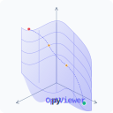

#  pyOptViewer


**pyOptViewer** is a real-time, web-based visualization tool for derivative-free optimization algorithms.

Built on top of [pyBlindOpt](https://github.com/mariolpantunes/pyBlindOpt), it provides an interactive 3D environment to observe how different metaheuristics—from basic Hill Climbing to advanced Swarm Intelligence—navigate complex fitness landscapes.

This tool is designed for **education and research**, allowing users to visually inspect the impact of initialization strategies, population dynamics, and convergence behaviors in real-time.

## Key Features

* **Real-Time Visualization**: Watch the population evolve generation-by-generation using **Server-Sent Events (SSE)**.
* **Dual-View Analysis**:
    * *True Landscape*: See the agents moving on the actual function surface.
    * *Explored Surface*: Visualize the "mental map" of the algorithm (the mesh constructed strictly from visited points).
* **High Performance**: Uses **Web Workers** to offload data processing, ensuring smooth 60fps rendering even with large populations.
* **Advanced Initialization**: Native support for modern initialization strategies including **Opposition-Based Learning (OBL)**, **Sobol Sequences**, and **Chaotic Maps**.
* **Interactive Control**: Adjust population size, epochs, delay speed, and stopping thresholds on the fly.

## Supported Algorithms & Methods

**pyOptViewer** exposes the full power of the underlying library:

| Category | Algorithms |
| :--- | :--- |
| **Swarm Intelligence** | Particle Swarm Optimization (PSO), Grey Wolf Optimization (GWO) |
| **Evolutionary** | Differential Evolution (DE), Genetic Algorithm (GA) |
| **Local Search** | Hill Climbing (HC), Simulated Annealing (SA) |
| **Baseline** | Random Search (RS) |

### Initialization Strategies

* **Standard**: Random (Uniform)
* **Space-Filling**: Sobol Sequence, Latin Hypercube (LHS)
* **Chaotic**: Tent Map
* **Opposition**: OBL, OBLESA (OBL + Empty Space Attack)

## Installation

1.  **Clone the repository**
    ```bash
    git clone https://github.com/mariolpantunes/pyOptViewer
    cd pyOptViewer
    ```

2.  **Create a Virtual Environment (Recommended)**
    ```bash
    python -m venv venv
    source venv/bin/activate
    ```

3.  **Install Dependencies**
    ```bash
    pip install -r requirements.txt
    ```

## Usage

1.  **Start the Flask Server**
    ```bash
    python app.py
    ```

2.  **Open the Visualizer**
    Navigate to `http://127.0.0.1:5000` in your web browser.

3.  **Configure & Run**
    * Select an **Objective Function** (e.g., *Rastrigin* for a challenge, *Sphere* for baseline).
    * Choose an **Algorithm** and **Initialization Method**.
    * Set the **Population Size** (larger populations explore better but run slower).
    * Click **Start Optimization**.

## Project Structure

```text
pyOptViewer/
├── app.py              # Flask backend (SSE streaming & Logic)
├── static/
│   ├── main.js         # Frontend logic (Plotly & UI handling)
│   ├── worker.js       # Web Worker (Data accumulation & Mesh generation)
│   └── style.css       # Nord-themed styling
├── templates/
│   └── index.html      # Main application layout
└── README.md           # Documentation

```

## Theme

The UI is styled using the **Nord** color palette, providing a clean, distraction-free environment for long research sessions. The 3D plots use the **Viridis** colormap for perceptual uniformity.

## Contributing

Contributions are welcome! If you want to add new visualization metrics (e.g., convergence curves) or support new algorithms:

1. Fork the repository.
2. Create a feature branch (`git checkout -b feature/NewMetric`).
3. Commit your changes.
4. Open a Pull Request.

## Authors

  * **Mário Antunes** - [mariolpantunes](https://github.com/mariolpantunes)

## License

This project is licensed under the MIT License - see the [LICENSE](LICENSE) file for details.

---

*Built with [Flask](), [Plotly.js](), and [pyBlindOpt]().*
