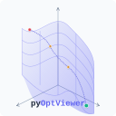

#  pyOptViewer


**pyOptViewer** is a real-time, web-based visualization tool for derivative-free optimization algorithms.

Built on top of [pyBlindOpt](https://github.com/mariolpantunes/pyBlindOpt), it provides an interactive 3D environment to observe how different metaheuristics—from basic Hill Climbing to advanced Swarm Intelligence—navigate complex fitness landscapes.

This tool is designed for **education and research**, allowing users to visually inspect the impact of initialization strategies, population dynamics, and convergence behaviors in real-time.

## Key Features

Page layout, top to bottom:

1. **Playback bar** (sticky): play/pause, step, scrub, speed (1–32 epochs/s), smooth motion, log fitness scale.
2. **Dual 3D view** (core, cameras synchronised):
    * *True Landscape & Population*: the agents on the actual function surface.
    * *Explored Surface Reconstruction*: the algorithm's "mental map", a Delaunay-triangulated `mesh3d` (`alphahull: -1`) over every point visited up to the current epoch, coloured by fitness.
3. **2D search space** next to the **convergence plot**:
    * A log-scaled heatmap with contours, showing the moving population, fading trails, a halo on individuals that improved this epoch, the best-so-far marker, the global optimum and, optionally, every visited point.
    * Best and mean gap to the known optimum `f*`, with a cursor that follows playback.

The sidebar holds the configuration and live statistics: epoch, best, gap to `f*`, mean, diversity and population size.

**Live evolution** (default): a custom pyBlindOpt callback (`LiveCallback` in `optviewer/runs.py`) publishes every generation as it is computed. It then blocks the optimizer thread until the viewer's playback cursor is at most 2 epochs behind. The population evolves at the speed you watch it: pausing or stepping pauses or steps pyBlindOpt itself, and the 2-epoch lookahead gives the animation a next frame to ease towards. Untick *Live* to compute the whole run at once and replay it. Every computed epoch is kept, so you can scrub back at any time. One FastAPI process serves the UI, a REST API for setup and a WebSocket for live frames.

Keyboard: `Space` play/pause, `←`/`→` step, `Home`/`End` first/last epoch.

## Supported Algorithms & Methods

Everything in [pyBlindOpt](https://github.com/mariolpantunes/pyBlindOpt) ≥ 0.5.0 is exposed, including each algorithm's hyperparameters:

| Family | Algorithms |
| :--- | :--- |
| **Baseline** | Random Search |
| **Local search** | Hill Climbing, Simulated Annealing |
| **Evolutionary** | Genetic Algorithm (blend/linear crossover; polynomial/gaussian/random mutation), Differential Evolution (14 variants × policies: fixed, archive, JADE, SHADE, L-SHADE, CoDE, SaDE, ensemble) |
| **Swarm** | PSO, Grey Wolf, Enhanced Grey Wolf, Artificial Bee Colony, Firefly, Harris Hawks, Cuckoo Search, Honey Badger |

**Objective functions** (all on [-5, 5]²): Sphere, Rastrigin, Ackley, Rosenbrock, Griewank, Styblinski-Tang, Levy, Zakharov, Dixon-Price, Schwefel, Lunacek bi-Rastrigin.

**Initialisation** = a sampler combined with an optional strategy:

* Samplers: Random, Latin Hypercube, Sobol, Chaotic.
* Strategies: None, OBL, Quasi-OBL, OBLESA, Round.

## Installation

```bash
git clone https://github.com/mariolpantunes/pyOptViewer
cd pyOptViewer
python -m venv venv
venv/bin/pip install .
```

## Usage

```bash
venv/bin/python -m optviewer            # http://127.0.0.1:8000
venv/bin/python -m optviewer --host 0.0.0.0 --port 8080 --reload
```

Pick a function, an initialisation and an optimizer. The initial population is previewed as you change them. Press **Run**.

## API

Interactive docs are served at `/docs`.

| Method | Path | Purpose |
| :--- | :--- | :--- |
| `GET` | `/api/config` | Functions (with optima), samplers, strategies, algorithms and their parameter schema |
| `GET` | `/api/surface/{function}?resolution=N` | Function values on an N×N grid |
| `POST` | `/api/preview` | Initial population for `{function, sampler, strategy, pop_size, seed}` |
| `POST` | `/api/runs` | Start a run (preview fields + `algorithm, epochs, threshold, params, live`); returns `id` and `ws` |
| `GET` | `/api/runs/{id}?since=K` | Status and frames from index K (polling alternative) |
| `PUT` | `/api/runs/{id}/cursor` | `{index}`: advance a live run (the optimizer may run 2 frames past it) |
| `DELETE` | `/api/runs/{id}` | Cancel and forget a run |
| `WS` | `/ws/runs/{id}?since=K` | Buffered frames, then live ones (`{"type": "frame"}`), then `{"type": "end"}`. The client sends `{"type": "cursor", "index": i}` to pace live runs |

A frame is `{epoch, pop, scores, best_pos, best_score, mean_score}`. Frame 0 is the initial population. `threshold` stops the run once `best − f* ≤ threshold`. A live run nobody advances for 5 minutes is cancelled.

## Development

```bash
venv/bin/pip install -q --upgrade . --group test
PYTHONPATH=. venv/bin/python -m unittest
pre-commit install          # run the CI gate on every commit
pre-commit run --all-files
```

The pre-commit hooks and `.github/workflows/ci.yml` run the same checks: ruff (lint and format), basedpyright, vulture, `node --check` on `static/js`, unittest, and coverage (≥ 90%). The lint tools are expected on the system (`pipx install ruff basedpyright vulture pre-commit`); the project venv holds only runtime and test dependencies.

## Project Structure

```text
pyOptViewer/
├── optviewer/
│   ├── registry.py     # Functions, initialisers, algorithms + parameter schema
│   ├── runs.py         # Threaded runs, frame buffer, subscriptions
│   ├── server.py       # FastAPI app (REST + WebSocket + static UI)
│   └── __main__.py     # CLI entry point (uvicorn)
├── static/
│   ├── index.html
│   ├── style.css       # Nord theme
│   └── js/             # player, 2D canvas view, Plotly panels, API client
├── assets/
│   ├── logo.svg        # README logo (light background)
│   └── favicon.svg     # Tab icon / app badge for the dark UI
├── tests/
└── pyproject.toml
```

## Theme

The UI is styled using the **Nord** color palette, providing a clean, distraction-free environment for long research sessions. All views use the **Viridis** colormap for perceptual uniformity.

## Contributing

Contributions are welcome! If you want to add new visualization metrics (e.g., convergence curves) or support new algorithms:

1. Fork the repository.
2. Create a feature branch (`git checkout -b feature/NewMetric`).
3. Commit your changes.
4. Open a Pull Request.

## Authors

  * **Mário Antunes** - [mariolpantunes](https://github.com/mariolpantunes)

## License

This project is licensed under the MIT License - see the [LICENSE](LICENSE) file for details.

---

*Built with [FastAPI](https://fastapi.tiangolo.com), [Plotly.js](https://plotly.com/javascript/), and [pyBlindOpt](https://github.com/mariolpantunes/pyBlindOpt).*
